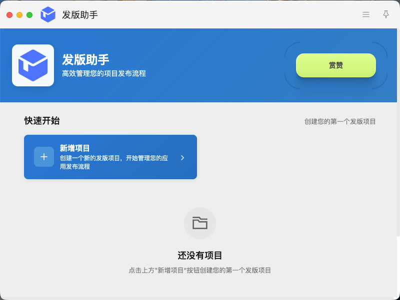
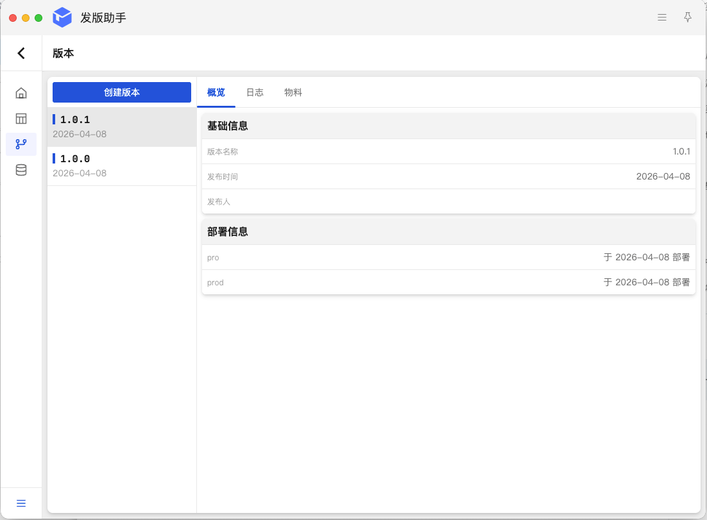
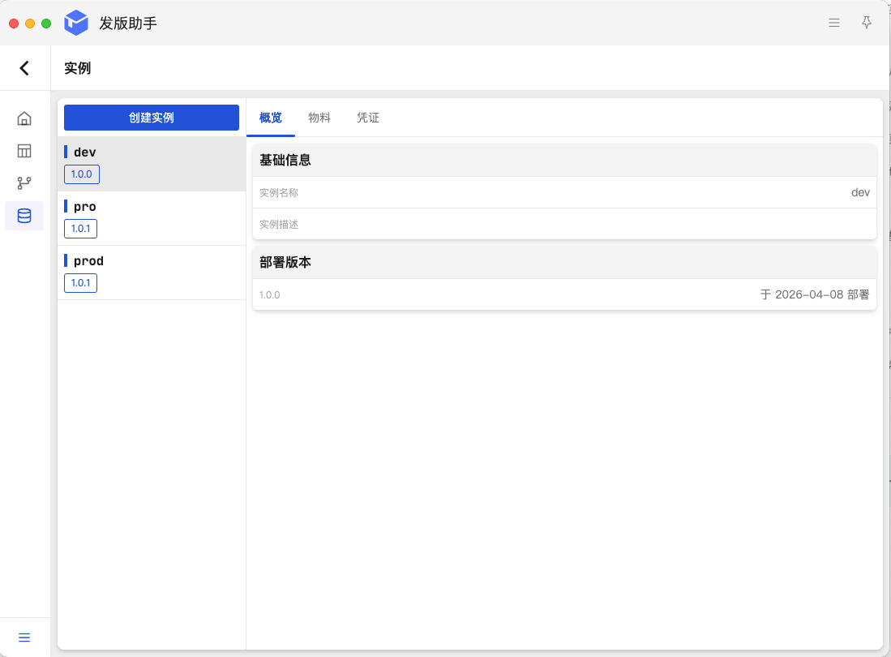
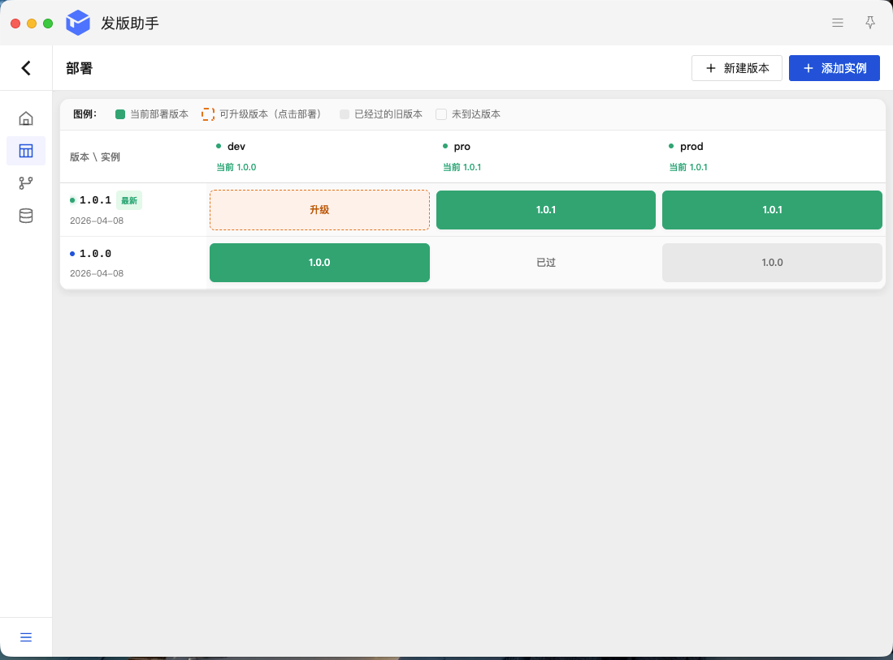

# deploy-x

**发版助手** —— 您的版本交付控制台

## 产品简介

发版助手是一款面向研发与运维团队的轻量级发版管理工具。它旨在解决版本管理混乱、部署环境配置复杂、发版记录难以追溯的痛点。通过结构化的项目管理与实例配置，帮助团队实现从“版本规划”到“交付上线”的全流程数字化记录。

## 核心功能亮点

**1. 项目与版本管理：记录每一次变更**
*   **项目新建**：快速构建项目空间，适配不同业务线。
*   **版本迭代**：支持新增版本号，在线编辑版本更新日志。
*   **物料管理**：直观维护每个版本的更新物料，确保交付内容清晰透明。
    **2. 实例管理：适配复杂部署场景**
*   **多环境定义**：支持新增不同的实例，灵活定义部署地点（如北京机房、阿里云）或部署环境（如开发、测试、生产）。
*   **独立配置**：针对每个实例，可独立配置物料信息与凭证信息，实现环境隔离与安全管控。
    **3. 发版执行与历史追溯：看得见的交付**
*   **一键发版**：完成配置后即可进行发版操作，系统自动记录发版时间与状态。
*   **全景追溯**：点击“最新的部署版本”，即可查看本次发版的完整快照：
    *   本次更新的**物料信息**；
    *   详细的**更新日志**；
    *   当时的**实例凭证**与**实例物料**配置。
    *   *确保任何一次发版都有据可查，即使版本回滚也能精准还原现场。*

## 适用场景

*   需要管理多个部署环境（Dev/Test/Prod）的开发团队。
*   需要记录详细发版凭证与物料变更的运维人员。
*   追求发版流程规范化、透明化的项目组。

## 应用截图

;

*   **首屏 Slogan：** 让发版不再是一场“盲盒”游戏。
*   **截图1（项目管理页）：** 标题——清晰的版本规划，日志物料一目了然。
*   **截图2（实例配置页）：** 标题——多环境独立配置，凭证物料安全隔离。
*   **截图3（发版详情页）：** 标题——点击即可追溯，发版历史全景还原。

## 安装注意

对于 `macos` 用户，如果出现文件已损坏，请在控制台执行`sudo xattr -r -d com.apple.quarantine /Applications/DeployX.app`
